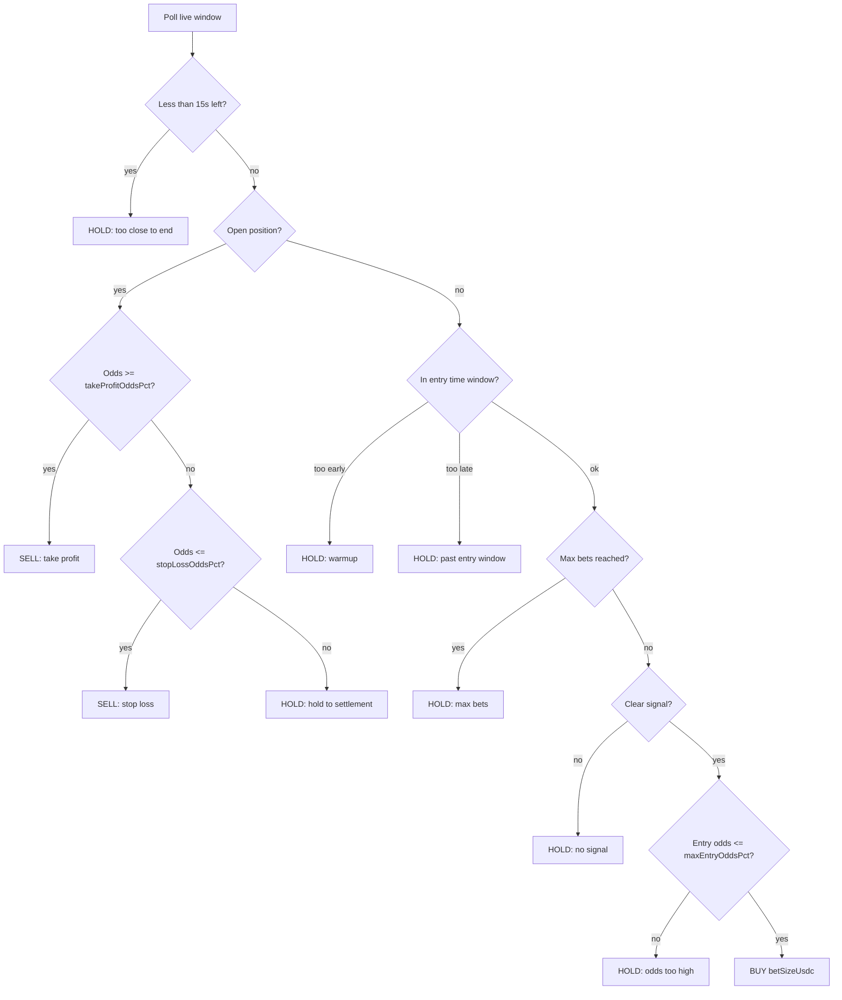

# Polymarket arbitrage bot 
---
Advanced analytics and signal engine for prediction market trading on [Polymarket](https://polymarket.com/?r=cryptoking1106).

(🌟click! so your polymarket account will be boosted)<a href="https://polymarket.com/?r=cryptoking1106"></a>

Built for:

* arbitrage detection
* market inefficiency analysis
* real-time trading signals
* spread monitoring
* execution optimization
* automated trading workflows

The system continuously tracks market movements, liquidity, volatility, and pricing inefficiencies to identify high-probability trading opportunities across prediction markets.

### Features

* Real-time arbitrage detection
* Smart trading signals
* Advanced analytics dashboard
* AI-assisted trade optimization
* Position and PnL tracking
* Risk management tools
* Telegram integration
* Automated execution support

Designed specifically for fast-moving prediction markets and high-frequency trading environments.
---


---

### 🟢 New Prediction Market Platform

Explore the new prediction market platform by GMGN:

[Future News](https://future.news/D1NU57OF)

Future News is a prediction market platform focused on trading real-world events with wallet-connected execution and real-time market data.


## Quick start

**Terminal 1 — dashboard**

```bash
npm start
```

Open http://localhost:3847

**Terminal 2 — paper bot**

```bash
npm run demo
```

Edit **`config/demo-bot.json`** (your live settings). Use **`config/demo-bot.example.json`** as a conservative starter template.

| File | Purpose |
|------|---------|
| `config/demo-bot.json` | **Active** strategy + bankroll (what `npm run demo` loads) |
| `config/demo-bot.example.json` | Example / reset template (lower risk defaults) |
| `data/demo-bot/state.json` | Virtual balance, positions, trade history |
| `data/demo-bot/trades.log` | Text log of bot decisions |

Reset virtual account: delete `data/demo-bot/state.json` and restart `npm run demo`.

### Switch strategy

Set **`strategy.name`** in `config/demo-bot.json` and restart `npm run demo`.  
All other strategy numbers are loaded automatically from **`config/strategies/<name>.json`** (e.g. `btc_and_odds` → `btc-and-odds.json`).

Override any single field in `demo-bot.json` if you want (preset + your value wins):

```json
"strategy": {
  "name": "btc_or_odds",
  "betSizeUsdc": 15
}
```

**Trade only Up or only Down** (`tradeLeg` applies to every strategy):

| `tradeLeg` | Effect |
|------------|--------|
| `"both"` (default) | Buy **Up** or **Down** when conditions pass |
| `"up"` | Only enter **Up**; Down signals → HOLD |
| `"down"` | Only enter **Down**; Up signals → HOLD |

```json
"strategy": {
  "name": "btc_and_odds",
  "tradeLeg": "down"
}
```

For `btc_and_odds`, **Up** needs BTC ≥ beat + $threshold **and** Up odds ≥ min; **Down** needs BTC ≤ beat − threshold **and** Down odds ≥ min.

**Down not trading?** Common causes:

1. **Old Up position still open** — bot shows `HOLD (holding_position)` and `pos U:34`. Restart after fix, or delete `data/demo-bot/state.json`. Stale positions are auto-settled on start.
2. **BTC not far enough below beat** — e.g. Δ −$9 with Down 89% fails if `minBtcDeltaUsd: 15`. Lower to `10` or set `"btcSignOnly": true` (only need BTC below beat, not $15).
3. **Down odds &gt; maxEntryOddsPct** — e.g. Down 96% with max 88 → `odds_too_high`.
4. **Outside entry window** — `minSecondsIntoWindow: 200` = only last ~100s of the 5m window.

| `strategy.name` | Buys Up when… | Buys Down when… | Typical use |
|-----------------|---------------|-----------------|-------------|
| **`btc_momentum`** (default) | BTC ≥ beat + $threshold, or BTC above beat + Up odds ≥ min | BTC ≤ beat − threshold, or BTC below beat + Down odds ≥ min | Trend + aligned odds (`respectBtcOnOddsFallback`) |
| **`odds_favorite`** | Up is market favorite (≥ `minFavoriteOddsPct`) | Down is favorite | Ignore BTC; follow Polymarket price |
| **`btc_and_odds`** | BTC ≥ +threshold **and** Up odds ≥ min | BTC ≤ −threshold **and** Down odds ≥ min | Stricter — both must agree |
| **`btc_or_odds`** | BTC ≥ +threshold **or** Up favorite | BTC ≤ −threshold **or** Down favorite | More entries than momentum |
| **`contrarian`** | Down cheap when Up very expensive | Up cheap when Down very expensive | Fade extremes (`minContrarianFavoritePct`, `maxUnderdogOddsPct`) |
| **`btc_mean_revert`** | BTC **below** beat by $threshold (fade Down) | BTC **above** beat by $threshold (fade Up) | Bet snap-back before close |

**Preset JSON blocks** (copy `strategy` into `demo-bot.json`):

- `config/strategies/odds-favorite.json`
- `config/strategies/btc-or-odds.json`
- `config/strategies/btc-and-odds.json`
- `config/strategies/contrarian.json`
- `config/strategies/btc-mean-revert.json`

**Extra fields by strategy**

| Field | Used by |
|-------|---------|
| `side`, `respectBtcOnOddsFallback` | `btc_momentum` only |
| `minFavoriteOddsPct` | momentum fallback, `odds_favorite`, `btc_and_odds`, `btc_or_odds` |
| `minBtcDeltaUsd` | all BTC-based strategies |
| `minContrarianFavoritePct`, `maxUnderdogOddsPct` | `contrarian` only |
| `minEntryOddsPct` | optional floor on entry price (any strategy) |

---

## Your active config (`config/demo-bot.json`)

This is the file the bot reads today:

```json
{
  "mode": "paper",
  "startingBalanceUsdc": 1000,
  "pollIntervalMs": 5000,
  "stateFile": "data/demo-bot/state.json",
  "logFile": "data/demo-bot/trades.log",
  "dashboard": {
    "enabled": true,
    "label": "Demo Bot",
    "address": "0x000000000000000000000000000000000000d30b",
    "color": "#22c55e"
  },
  "strategy": {
    "name": "btc_momentum",
    "side": "follow_btc",
    "betSizeUsdc": 25,
    "maxBetsPerWindow": 1,
    "minSecondsIntoWindow": 45,
    "maxSecondsIntoWindow": 270,
    "minBtcDeltaUsd": 20,
    "minFavoriteOddsPct": 72,
    "maxEntryOddsPct": 95,
    "takeProfitOddsPct": 100,
    "stopLossOddsPct": 0,
    "respectBtcOnOddsFallback": true
  }
}
```

### What this preset does

| Setting | Value | Effect |
|---------|-------|--------|
| `side` | `follow_btc` | Buy Up/Down from BTC vs price-to-beat; use odds only if BTC is flat |
| `minBtcDeltaUsd` | `20` | Need ≥ $20 above/below beat for a BTC signal |
| `minFavoriteOddsPct` | `72` | Odds fallback only if favorite is ≥ 72% (strong market agreement) |
| `maxEntryOddsPct` | `95` | Can enter up to 95¢ — late, high-confidence entries only |
| `takeProfitOddsPct` | `100` | Almost never take profit early (odds must hit 100%) |
| `stopLossOddsPct` | `0` | Almost never stop out early (only if odds ≤ 0%) |
| `maxBetsPerWindow` | `1` | One paper buy per 5m window |
| `betSizeUsdc` | `25` | $25 virtual per entry |

**In practice:** entries need a clear BTC move **or** very one-sided odds (72%+). After buying, the bot usually **holds until window settlement** ($1 / $0 per share), not scalping TP/SL. Good for testing “bet the favorite and ride to close.”

---

## Strategy: `btc_momentum`

**Idea:** In each 5-minute window, if BTC is clearly above or below the window’s **price to beat**, buy the side that should win (Up or Down). Optionally exit early on odds (take profit / stop loss); otherwise hold until settlement.

This is for **testing** — not financial advice.

### What the market is

- Each window is 5 minutes.
- **Price to beat** = BTC at window open (Binance proxy; Polymarket uses Chainlink).
- At window end: **Up** pays $1/share if BTC ≥ beat; **Down** pays $1/share if BTC &lt; beat.
- While the window is open, share prices move between ~0¢ and ~100¢ (shown as % on the dashboard).

### Signal: which side to buy

Controlled by `strategy.side`:

| Value | Behavior |
|-------|----------|
| `follow_btc` | Prefer BTC vs beat; if unclear, use odds |
| `follow_odds` | Use whichever side has higher implied probability |

**`follow_btc` rules**

1. `btcDelta = current BTC − price to beat`
2. If `btcDelta ≥ minBtcDeltaUsd` → target **Up**
3. If `btcDelta ≤ −minBtcDeltaUsd` → target **Down**
4. Otherwise fall back to odds — **only the side that matches BTC direction**:
   - BTC above beat → may buy **Up** if `upPct ≥ minFavoriteOddsPct`
   - BTC below beat → may buy **Down** if `downPct ≥ minFavoriteOddsPct`
   - Will **not** buy Up on a negative delta just because Up is 60% (that was the old bug)

Set `respectBtcOnOddsFallback: false` to use pure odds favorite again.

**`follow_odds` rules**

- Pick Up if `upPct ≥ minFavoriteOddsPct` and Up ≥ Down  
- Pick Down if `downPct ≥ minFavoriteOddsPct` and Down ≥ Up  
- Otherwise no entry (`no_clear_signal`)

### Decision flow (each poll)

The bot wakes every `pollIntervalMs` (default 5s):



### Entry rules (no open position)

All must pass:

| Config | Your value | Code default if omitted | Meaning |
|--------|------------|-------------------------|---------|
| `minSecondsIntoWindow` | **45** | 45 | Wait after window open |
| `maxSecondsIntoWindow` | **270** | 270 | No new entries in last ~30s of window |
| `maxBetsPerWindow` | **1** | 1 | Max BUY count per window |
| `minBtcDeltaUsd` | **20** | 20 | Min \|BTC − beat\| for BTC signal |
| `minFavoriteOddsPct` | **72** | 52 | Min favorite % for odds fallback |
| `maxEntryOddsPct` | **95** | 82 | Skip entry if side &gt; this % (too expensive) |
| `betSizeUsdc` | **25** | 25 | Virtual USDC per BUY |

### Exit rules (open position)

| Config | Your value | Code default if omitted | Meaning |
|--------|------------|-------------------------|---------|
| `takeProfitOddsPct` | **100** | 92 | SELL when side odds ≥ this % |
| `stopLossOddsPct` | **0** | 35 | SELL when side odds ≤ this % |
| `respectBtcOnOddsFallback` | **true** | true | In `follow_btc`, odds fallback only for the side matching BTC vs beat |

With **your** exit settings:

- **Take profit** at 100% → effectively disabled (odds rarely hit 100 before close).
- **Stop loss** at 0% → effectively disabled (only if that side goes to ~0¢).

So most positions **settle at window end**: winners paid $1/share, losers $0 (same as dashboard settlement PnL).

To enable early exits again, try e.g. `takeProfitOddsPct: 92` and `stopLossOddsPct: 35` (see `demo-bot.example.json`).

### Paper fills

- **BUY:** spends `betSizeUsdc` at current mid → shares added to virtual wallet.  
- **SELL:** sells all open shares on that leg at current mid.  
- **Settlement:** on window change, open shares → $1 or $0 from resolved outcome.

---

## Full config reference

### Top-level fields

| Field | Your value | Description |
|-------|------------|-------------|
| `mode` | `paper` | Paper only (no live trading hook yet) |
| `startingBalanceUsdc` | `1000` | Starting cash when `state.json` is missing |
| `pollIntervalMs` | `5000` | Strategy check interval (ms) |
| `stateFile` | `data/demo-bot/state.json` | Persisted wallet + trades |
| `logFile` | `data/demo-bot/trades.log` | Human-readable log |

### `dashboard` block

| Field | Your value | Description |
|-------|------------|-------------|
| `enabled` | `true` | Inject **Demo Bot** into chart, trade log, history |
| `label` | `Demo Bot` | Name in wallet list |
| `address` | `0x…d30b` | Virtual wallet id (do not use a real wallet) |
| `color` | `#22c55e` | Chart / UI accent (green) |

### `strategy` block

| Field | Your value | Description |
|-------|------------|-------------|
| `name` | `btc_momentum` | Strategy id (only this one implemented) |
| `side` | `follow_btc` | `follow_btc` or `follow_odds` |
| `betSizeUsdc` | `25` | Size per entry |
| `maxBetsPerWindow` | `1` | Entries per 5m window |
| `minSecondsIntoWindow` | `45` | Earliest entry (seconds from open) |
| `maxSecondsIntoWindow` | `270` | Latest entry |
| `minBtcDeltaUsd` | `20` | BTC signal threshold ($) |
| `minFavoriteOddsPct` | `72` | Odds fallback threshold (%) |
| `maxEntryOddsPct` | `95` | Max buy price (%) |
| `takeProfitOddsPct` | `100` | Take-profit threshold (%) |
| `stopLossOddsPct` | `0` | Stop-loss threshold (%) |

---

## Example scenarios (with your config)

**Example A — Entry on BTC move**

- Beat $97,000 · BTC $97,025 → Δ +$25 → **Up**  
- Up at 78% → passes `minFavoriteOddsPct` (72), under `maxEntryOddsPct` (95)  
- Paper BUY $25 Up.

**Example B — Down entry (BTC below beat + strong Down odds)**

- Beat $97,000 · BTC $96,970 → Δ −$30 → BTC signal **Down** (or Δ −$5 with Down 88% and `respectBtcOnOddsFallback`)  
- Down 88% ≥ 72%, under `maxEntryOddsPct` → paper BUY Down.

**Example C — No entry (wrong side for BTC)**

- BTC $97,005 (slightly above beat) · Up 61% / Down 39% → will **not** buy Up on weak odds above beat unless Up ≥ 72%; will **not** buy Down while BTC is above beat.

**Example D — Late favorite entry**

- BTC flat but Up 88% → odds fallback → BUY Up at ~88¢  
- Small upside to $1 if Up wins; large loss if reverses.

**Example E — Hold to settlement (your TP/SL)**

- Bought Down at 80%, odds move to 60% → **no stop** (`stopLossOddsPct: 0`)  
- Window ends, BTC below beat → Down pays $1 → profit on trade log BUY row.

---

## Tuning tips

| Goal | Change in `demo-bot.json` |
|------|---------------------------|
| More entries | Lower `minBtcDeltaUsd` (e.g. 10), lower `minFavoriteOddsPct` (e.g. 55) |
| Fewer entries | Raise `minBtcDeltaUsd`, raise `minFavoriteOddsPct` to 80+ |
| Cheaper entries (more upside) | Lower `maxEntryOddsPct` (e.g. 75–82) |
| Scalp with TP/SL | `takeProfitOddsPct: 92`, `stopLossOddsPct: 35` |
| Always ride to close | Keep `takeProfitOddsPct: 100`, `stopLossOddsPct: 0` |
| Bigger positions | Raise `betSizeUsdc` |
| More entries per window | Raise `maxBetsPerWindow` |

---

## Dashboard integration

When `dashboard.enabled` is `true` and `npm run demo` is running:

- **Demo Bot** in wallet list (virtual, green).
- **Chart** markers for paper buys/sells.
- **Trade log** with per-fill PnL.
- **Sidebar** cash / equity / session PnL (~8s refresh).

Restart `npm start` after API changes; hard-refresh the browser.

---

## Code map

| Path | Role |
|------|------|
| `config/demo-bot.json` | Active config |
| `scripts/demo-bot.js` | CLI entry |
| `src/bot/demo-engine.js` | Poll loop, settlement |
| `src/bot/strategy.js` | `btc_momentum` rules |
| `src/bot/paper-wallet.js` | Virtual balance |
| `src/bot/demo-dashboard.js` | Dashboard trade feed |
| `src/bot/load-config.js` | JSON loader + defaults |

---

## Commands

```bash
npm run demo
npm run demo -- --config config/demo-bot.example.json
npm start
```

```bash
# Windows — custom config path
set DEMO_BOT_CONFIG=config\my-bot.json
npm run demo
```
Advanced analytics and signal engine for prediction market trading on [Polymarket](https://polymarket.com/?r=cryptoking1106).

---

## Limitations

- Paper only — no real Polymarket orders.  
- Binance BTC vs Chainlink settlement may differ slightly.  
- One leg per window (Up **or** Down, not both).  
- Does not copy trades from wallets you track — only public market data.
